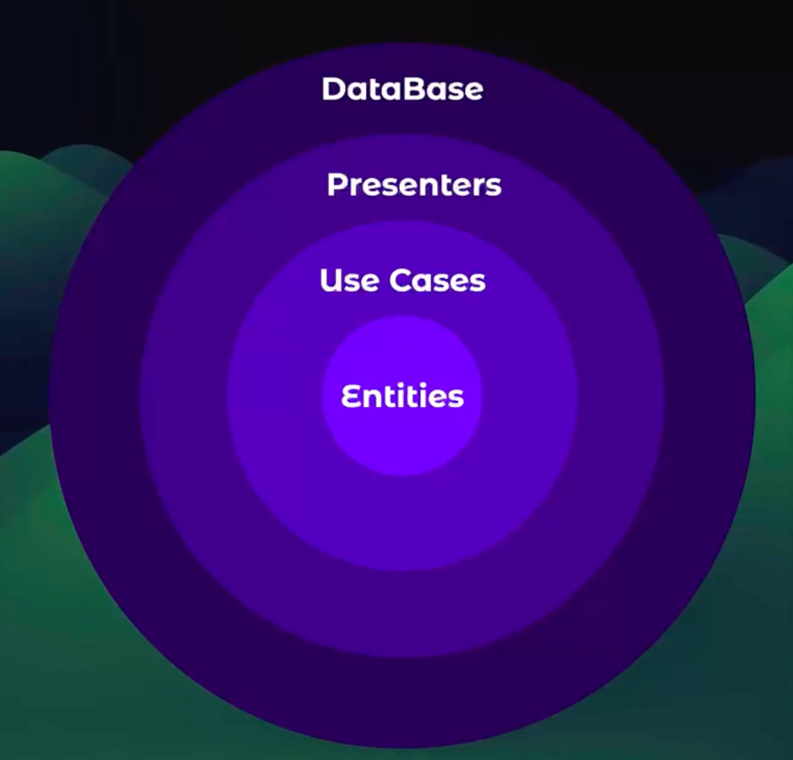

# [Clean Architecture with NodoJs](NOTAS.md)

## What to learn when building this Application

Rest API for Authentication and Creation of Users.

Implementing repository patterns for integration of database.

### Carpetas

1. __Presentation__ (Parte más externa de la aplicación, aloja framework o librerias como React, etc... es la parte más cercana a quien consume la aplicación)
2. __Domain__ (Reglas de negocio que gobiernan nuestra app, casos de uso, como se implementan los adapters, los datasources como funcionan los reposirios... El codigo de está carpeta no tendra dependencias externas)
   1. __dtos__ (Data transfers object nos sirve para transformar los datos que recibimos por endpoint disponible)
   2. __entities__ ()
   3. __datasources__ (Definir las reglas de negocio de las cueles se van a regir la obtencion de los datos. Son Abstracciones, no son implementaciones)
   4. __repositories__ (Son los que se van a comunicar con nuestros datasources. Son Abstracciones, no son implementaciones)
3. __infrastructure__ (Le gusta crearla al Profesor - Y esta carpeta represena un punto intermedio entra __domain__ y __presentation__. Aquí creamos las implementaciones de los datasources, de los repositories, los mappers)
   1. __datasources__ (En esta carpeta crearmos las implementaciones de los datasources)
   2. __repositories__ ()

Robert C. Martin - Propuso la implementación de la arquitectura limpia.

La comunicación se realiza de los circulos exteriores a los circulos interiores y los circulos interiores no se comunican con los circulos exteriores.

### Consideraciones 

No debería afectar si:

1. Cambiamos la base de datos
2. Cambiamos alguna dependencia
3. Añadimos o eliminamos funciones
4. Queremos trabajar con múltiples orígenes de datos o destinos