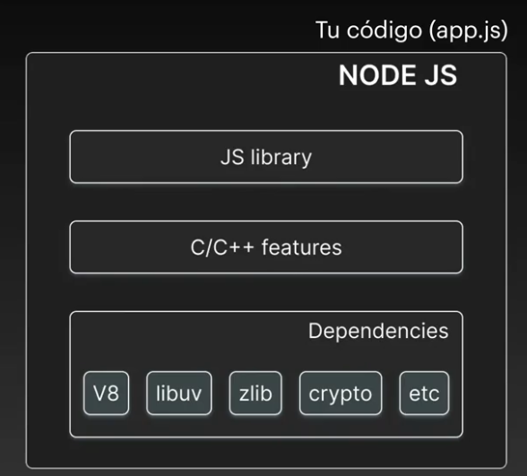

### INICIALIZAR PACKAGE.JSON

```
npm init

npm init -Y --> Se crea con los valores por defecto
```

### BUSCAR semantic version

[semver.org](https://semver.org/)

Dado un número de versión MAYOR.MENOR.PATCH, incrementa la:

__Versión MAYOR__: 
> cuando realices cambios incompatibles en la API

__Versión MENOR__:
> cuando agregues funcionalidad de manera compatible hacia atrás

__Versión PATCH__: 
> cuando realices correcciones de errores compatibles hacia atrás

Etiquetas adicionales para pre-lanzamiento y metadatos de compilación están disponibles como extensiones al formato MAYOR.MENOR.PATCH.

### CREAR UN SERVIDOR CON EXPRESS

[NPM Express](https://www.npmjs.com/package/express)

[Documentacion](https://expressjs.com/es/)

```console
 npm install express
````

```javascript
const express = require('express')
const app = express()

app.get('/', function (req, res) {
  res.send('Hello World')
})

app.listen(3000)
```

### Frameworks para crear pagina web renderizables desde el servidor dinamicas**

[Handlebars.js web](https://handlebarsjs.com/)

[Handlebars.js Github](https://github.com/pillarjs/hbs)

[Handlebars.js](https://www.npmjs.com/package/handlebars)


#### Node Code Execution

[The Node.js Event Loop](https://nodejs.org/en/learn/asynchronous-work/event-loop-timers-and-nexttick)

[Guia Visual Completa para entender el Node.js Event Loop](https://www.builder.io/blog/visual-guide-to-nodejs-event-loop)

Node tiene __3 componentes (características) principale



* Dependencias externas
  - V8
  - libuv
  - zlib
  - crypto
  - etc.... grande

__libuv__: Le permite a Node trabajar en tareas asincronas, callbacks o cualquier código que requira esperar una ejecución o respuesta.

> [Web Oficial](https://libuv.org/)

> [Understanding libuv](https://zmushegh.medium.com/understanding-libuv-the-powerhouse-behind-node-js-b5349c8f0d75)

* Características de C++
* Librerias de JS que se conectan con C++ desde nuestro Código